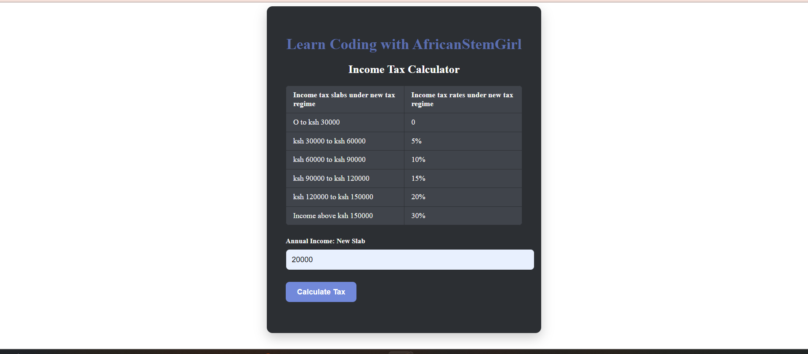
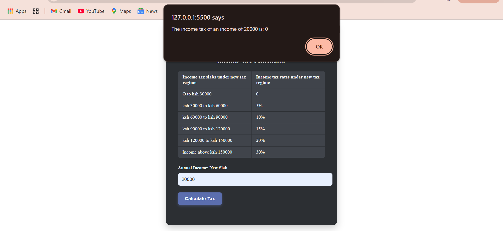

# Income Tax Calculator

An interactive web-based income tax calculator that allows users to quickly calculate their annual tax based on specific income brackets.

## Project Description

The Income Tax Calculator is a web application designed to help users calculate their annual tax amount according to a predefined set of income brackets. This project provides an easy-to-use interface and calculates taxes based on user input, with a stylish dark mode layout. Built with HTML, CSS, and JavaScript, this calculator ensures a user-friendly and visually appealing experience.

### Technologies Used
- **HTML**: Creates the structure and content of the calculator, organizing input fields and tables.
- **CSS**: Styles the calculator, giving it a modern, dark-themed UI.
- **JavaScript**: Implements the tax calculation logic and handles user interactions.

### Challenges and Future Features
One of the key challenges was managing conditional tax brackets efficiently. Future updates may include additional tax regimes, support for more complex calculations, and integration with other tax resources.

## Table of Contents
1. [Installation](#installation)
2. [Usage](#usage)
3. [Credits](#credits)
4. [License](#license)

## Installation

To use the Income Tax Calculator locally:

1. **Clone the Repository**:
   git clone https://github.com/Darlington2030/taxCalculator.git

2. **Navigate to the Project Directory**:
   
   cd taxCalculator
   
3. **Open the HTML file**:
   Open `index.html` in a web browser to start using the calculator locally.

## Usage

### How to Use the Calculator
1. Open the calculator in a browser.
2. Enter your annual income in the input field labeled **Annual Income: New Slab**.
3. Click the **Calculate Tax** button to see the tax calculated according to the income slabs provided.
4. The calculator will display the tax amount in an alert.

### Example
For an income of 75,000:
- Enter `75000` in the input field.
- Press **Calculate Tax**.
- The calculator will display the tax amount based on the configured slabs.

### Interface Overview
The calculator interface includes:
- **Tax Slab Table**: Displays income tax brackets.
- **Input Field**: Allows users to enter annual income.
- **Calculate Button**: Calculates the tax based on the provided income.

### Screenshot

## Credits

Created by [Darlington Maloba] [africanStemGirl.com]

## License

This project is licensed under the MIT License - see the [LICENSE](LICENSE) file for details.

